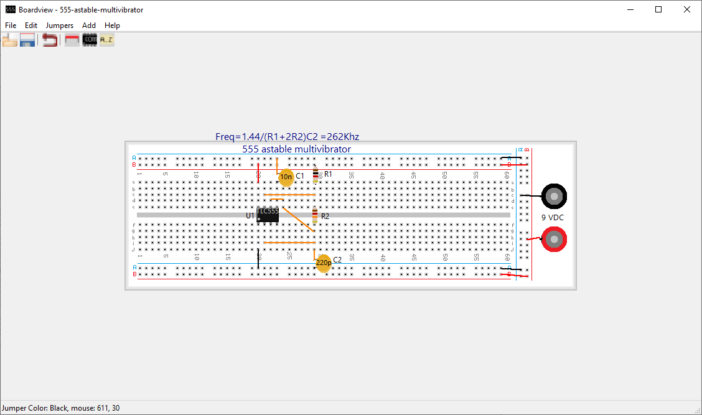

# Boardview

A Windows application to design solderless prototyping board circuit.

There was an original version written in [open euphoria](https://openEuphoria.org) the source code of which was lost and 
a [new version](lazarus-source)  written using [Lazarus/free pascal IDE](https://www.lazarus-ide.org/).

## 2021-12-22

I prepared a Windows setup package for the new [lazarus/free pascal version v1.0](lazarus-source/boardview-setup.exe). 

At first dialog of installation choose the option **install only for me** so the application will be install in 
**%homepath\AppData\Local\Programs\Boardview-laz**.  Otherwise write access will be denied. The application require write access 
in the application directory for **boardview.ini** and **component.ini** and if you want to add components in **bitmaps** subdir.
  
