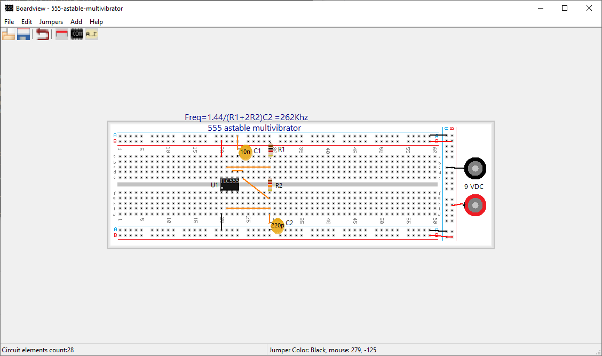

# Boardview

A Windows application to design solderless prototyping board circuit.

There was an original version written in [open euphoria](https://openEuphoria.org) the source code of which was lost and 
a [new version](lazarus-source)  written using [Lazarus/free pascal IDE](https://www.lazarus-ide.org/).

### 2022-01-01

Version 1.1.4  Released. Popup menu work by right clicking anywhere on the application client area and 2 items added to menu. 

* **Add tag...**  to open **Add tag** dialog.

* **Add Component...** to open **Components** dialog. 

These 2 items reduce mouse displacement. No need to go to the toolbar anymore. 

### 2021-12-27

Version 1.1 released.  No new functionnalities, only behavior change. See [lazarus-source/worklog.md](lazarus-source/workLog.md) and user manual update.
Windows installation package [lazarus-source/boardview-laz-1.1.exe](lazarus-source/boardview-laz-1.1.exe).

## 2021-12-22

I prepared a Windows setup package for the new [boardview-laz version v1.0](lazarus-source/boardview-setup.exe). 

At first dialog of installation choose the option **install only for me** so the application will be installed in 
**%homepath\AppData\Local\Programs\Boardview-laz**.  Otherwise it will be install in **C:\program (x86) files\boardview-laz**  and write access will be denied. The application require write access 
in the application directory for **boardview.ini** and **component.ini** and if you want to add components in **bitmaps** subdir.
  
### français

J'ai préparé un paquet d'installation Windows pour la nouvelle version de [boardview-laz v1.0](lazarus-source/boardview-setup.exe) créée avec [Lazarus/free pascal IDE](https://www.lazarus-ide.org/).

Lorsque le programme d'installation démarre choississez l'option **installer seulement pour moi**. Avec cette option l'application est installée dans
  **%homepath%\AppData\Local\Programs\boardview-laz**.  Autrement l'application sera installée dans le dossier 
  **C:\Program Files (x86)\boarview-laz**. Le problème est qu'il faut des droits d'administrateur pour écrire dans ce dossier.
